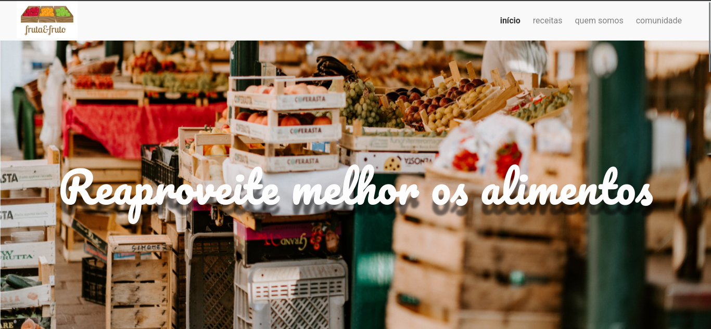
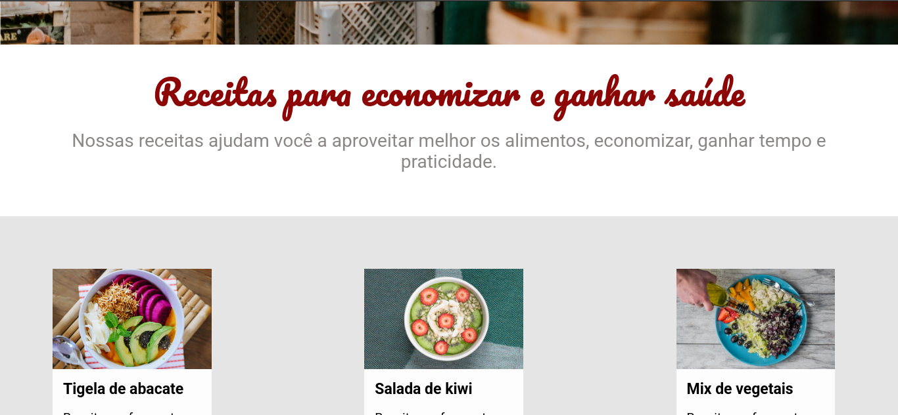
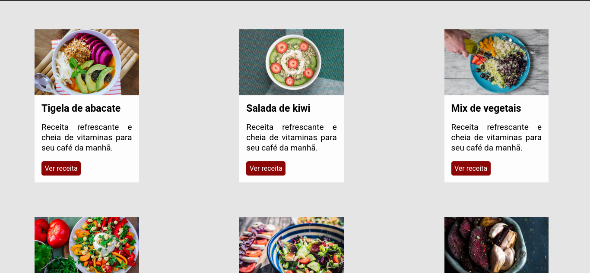
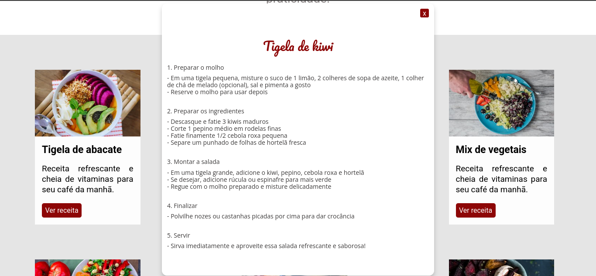

# Fruta&Fruto Frontend 🍏🍓

Frontend da API Fruta&Fruto

## 🔧 Tecnologias
- Html
- Css
- Javascript

## 👾 Setup do Projeto

### 📌 1. Clone o repositório
git clone https://github.com/MatheusVictor23/Fruta-Fruto.git
cd Fruta-Fruto 

## 📸 Fruta&Fruto  

**Tela inicial Fruta&Fruto**

**Apresentação Fruta&Fruto**

**Receitas Fruta&Fruto**

**Modo de Preparo**

## 🔗 Deploy  
O deploy da aplicação foi feita na Render

Acesse a aplicação: [Projeto ao vivo](https://fruta-fruto.onrender.com/)  